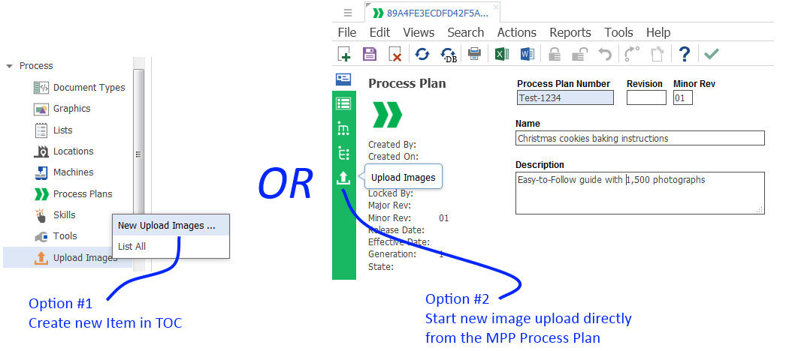
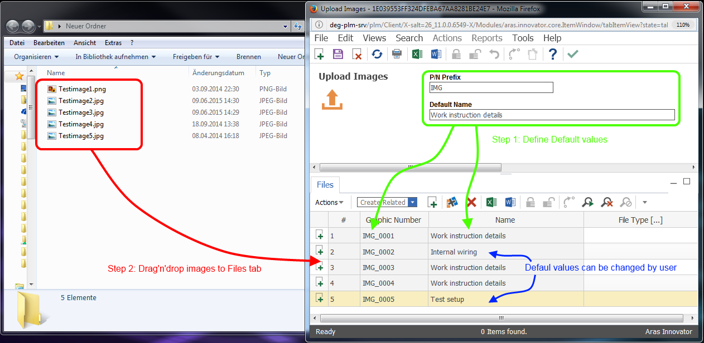
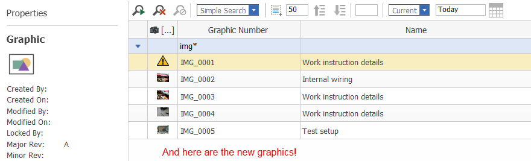

# Image Uploader for MPP and technical documents

## Description

This project contains an import package that adds an additional **Upload Images** ItemType into Aras.

Normally you have to do the following steps to upload graphics for MPP Process Plans:
Graphics -> New Graphic… -> Select an image… ->  External File –> Start file picker -> Pick the file -> OK

Adding 100 pictures to a work instruction would require repeating these steps for each image.
But help is at hand!
With the feature you can add multiple graphics at once!

## Project Details

#### Built Using:
Aras 11.0 SP9

#### Versions Tested:
Aras 11.0 SP9

#### Browsers Tested:
Internet Explorer 11, Chrome 61.0, Firefox ESR 52.4.0

## Installation

#### Important!
**Always back up your code tree and database before applying an import package or code tree patch!**

### Prerequisites

1. Aras Innovator installed (version 11.0 SPx preferred)
2. Aras Package Import tool
3. Import package of this project
4. MPP and/or Tech Docs must be installed in the target database

### Install Steps

#### Code tree Installation
These code tree changes only contain a custom icon for the toolbar. If you wish to use your own icon, you may replace the .svg file in the `\Innovator\` folder with your own.

1. Backup your code tree and store the archive in a safe place
2. Navigate to your local `..\aras-image-uploader-for-tech-docs\` folder
3. Copy the `\Innovator\` folder 
4. Paste this at the root of your install directory
+ By default this is `C:\Program Files\Aras\Innovator\`

#### Database Installation
1. Backup your database and store the BAK file in a safe place.
2. Open up the Aras Package Import tool.
3. Enter your login credentials and click **Login**
    * _Note: You must login as root for the package import to succeed!_
4. Enter the package name in the TargetRelease field.
    * Optional: Enter a description in the Description field.
5. Enter the path to your local `..\uploadMppImages\Import\imports.mf` file in the Manifest File field.
6. Select **bpl.app.uploadMppImages** in the Available for Import field.
7. If the target database has the Technical Documentation application installed, select the **bpl.app.uploadMppImages.techDocOptions** package.
8. If the target database has the MPP application installed, select the **bpl.app.uploadMppImages.mppOptions** package.
9. Select Type = **Merge** and Mode = **Thorough Mode**.
10. Click **Import** in the top left corner.
11. Close the Aras Package Import tool.

You are now ready to login to Aras and try out the image importer.

## Usage

1. Login to Aras.
2. Make sure, that you are a member of the Identity **Manufacturing Engineering** or **Technical Documentation Author**.
3. Navigate to **Process > Upload Image** in the table of contents (TOC).
4. Right click on **Upload Image** and click **New Upload Images** 

5. Set default values for the Graphics number and Name in the Form
6. Add images to the Files tab with drag'n'drop.

7. Click **Save** to upload the files

WARNING: Once stored image properties can not be overwritten!
8. Navigate to **Process > Graphics** and find your new Images there!

## Contributing

1. Fork it!
2. Create your feature branch: `git checkout -b my-new-feature`
3. Commit your changes: `git commit -am 'Add some feature'`
4. Push to the branch: `git push origin my-new-feature`
5. Submit a pull request

## Credits

Created by @AngelaIp

Contributions by:
* @EliJDonahue

## License

This project is published to Github under the Microsoft Public License (MS-PL). See the [LICENSE file](./LICENSE.md) for license rights and limitations.
